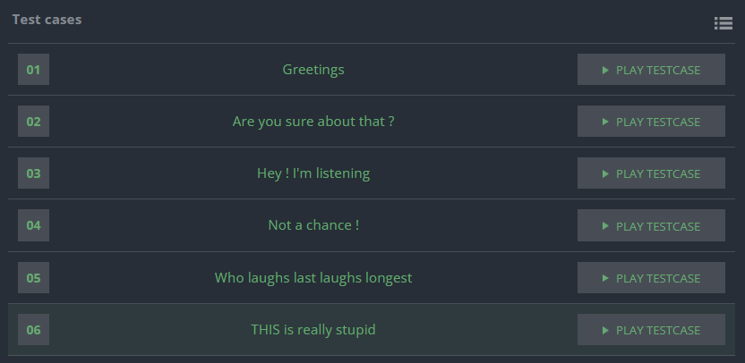
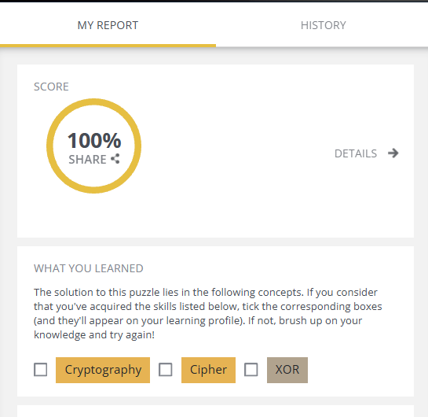
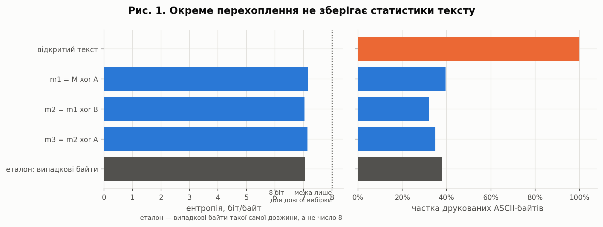
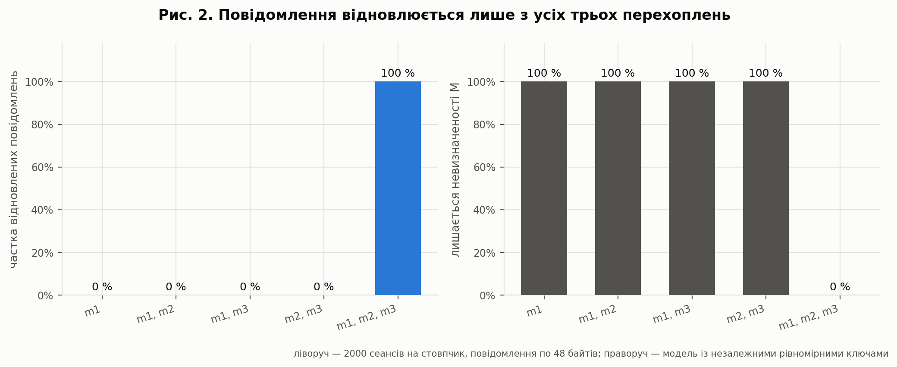
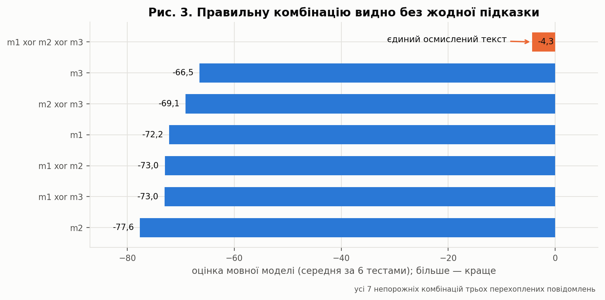
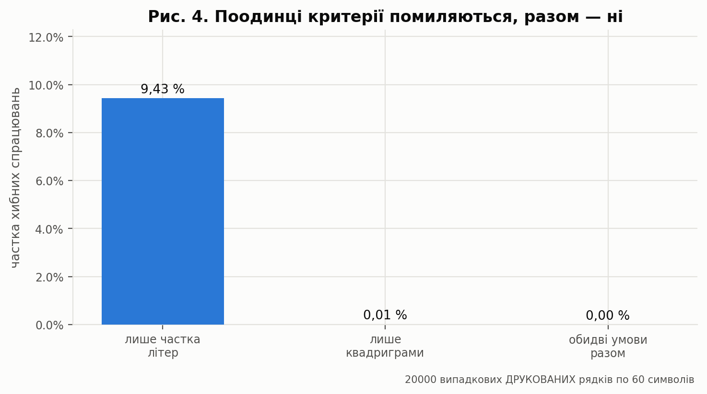
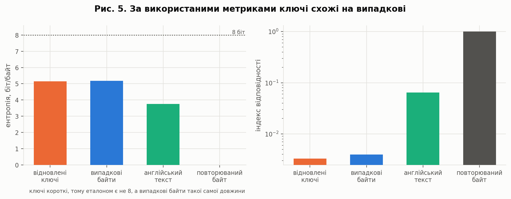
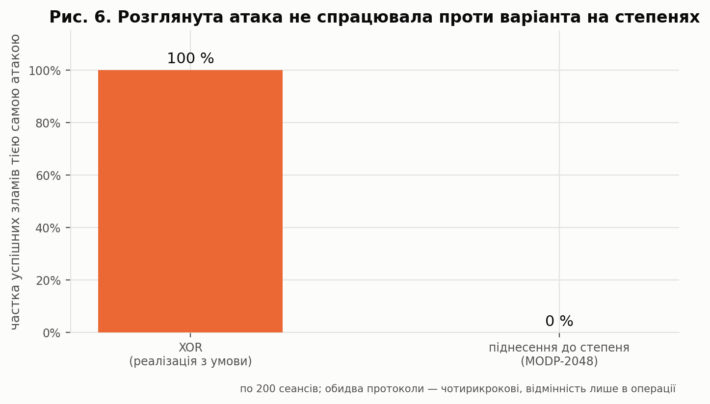

<div align="center">

# Лабораторна робота №4 — Hacking at RobberCity

### Злам триетапного протоколу обміну, реалізованого на XOR

[](https://github.com/RE22GDV/LR4-RobberCity/actions/workflows/ci.yml)


**Ключі бездоганні. Зламано протокол.**

</div>

---

## Зміст

1. [Мета та постановка задачі](#1-мета-та-постановка-задачі)
2. [Чому це ламається](#2-чому-це-ламається)
3. [Структура репозиторію](#3-структура-репозиторію)
4. [Швидкий старт](#4-швидкий-старт)
5. [Верифікація рішення](#5-верифікація-рішення)
6. [Криптоаналіз](#6-криптоаналіз)
7. [Як мало бути правильно](#7-як-мало-бути-правильно)
8. [Висновки](#8-висновки)
9. [Відтворення результатів](#9-відтворення-результатів)
10. [Джерела](#10-джерела)

---

## 1. Мета та постановка задачі

Задача взята з платформи CodinGame (Training, рівень Medium) і має назву
**Hacking at RobberCity**. На відміну від двох попередніх робіт, тут
ламається не алгоритм шифрування, а **спосіб його застосування**.

### Постановка (за умовою)

У місті, де всі листоноші — злодії, Аліса хоче надіслати Бобу посилку,
не передаючи ключа від замка. Класична загадка розв'язується так:

| Крок | Дія |
|---|---|
| 1 | Аліса замикає посилку своїм замком і надсилає Бобу |
| 2 | Боб вішає **свій** замок і повертає посилку Алісі |
| 3 | Аліса знімає **свій** замок і надсилає посилку знову |
| 4 | Боб знімає свій замок і відкриває посилку |

Жоден ключ не їде каналом. Схема відома в криптографії як **триетапний
протокол Шаміра**. Аліса й Боб вирішили реалізувати її на XOR з
одноразовим ключем — бо, як вони прочитали у Вікіпедії, одноразовий
блокнот «теоретично незламний».

Ми — перехоплювач. Нам доступні всі три повідомлення, що йдуть каналом,
у шістнадцятковому вигляді. Потрібно прочитати відкритий текст.

**Вхід:** три рядки шістнадцяткових цифр.
**Вихід:** відкритий текст.
**Обмеження:** довжина повідомлення ≤ 250 символів.

### Приклад із умови

```
391813c092a2d5ac9acb705dfe41be3df08de67d1145cbcc3f
03adeae2c8c2f2336c8a8d312733c2456e76e0b2d9068adc3f
72d0954e354045f09461dc4c911d0b58ff8963efb12c34303f
                      ↓
            Hello bob ! How are you ?
```

> **Що саме тут незламне.** Одноразовий блокнот справді незламний — але
> лише як шифр одного повідомлення одним ключем. Твердження про
> незламність не поширюється на протокол, у якому той самий ключ
> накладається й знімається в присутності спостерігача. Саме цю
> підміну понять і експлуатує задача.

---

## 2. Чому це ламається

Позначимо `M` — повідомлення, `A` — ключ Аліси, `B` — ключ Боба.
Каналом ідуть три рядки:

```
m1 = M ⊕ A              (крок 1)
m2 = m1 ⊕ B = M ⊕ A ⊕ B (крок 2)
m3 = m2 ⊕ A = M ⊕ B     (крок 3)
```

Крок 4 каналом не передається — тому повідомлень три, а не чотири.

### Це система лінійних рівнянь

XOR — це додавання в полі **GF(2)**. Отже, перехоплене — не три
незалежні шифротексти, а система з трьох рівнянь у трьох невідомих
`(M, A, B)`:

$$
\begin{pmatrix} 1 & 1 & 0 \\\\ 1 & 1 & 1 \\\\ 1 & 0 & 1 \end{pmatrix}
\begin{pmatrix} M \\\\ A \\\\ B \end{pmatrix} =
\begin{pmatrix} m_1 \\\\ m_2 \\\\ m_3 \end{pmatrix}
$$

Визначник цієї матриці над GF(2) дорівнює **1**, тобто система має
**повний ранг**. Звідси відновлюється не лише текст, а й **обидва
одноразові ключі**:

| Величина | Формула | Перевірка |
|---|---|---|
| повідомлення | `M = m1 ⊕ m2 ⊕ m3` | `(M⊕A) ⊕ (M⊕A⊕B) ⊕ (M⊕B) = M` |
| ключ Аліси | `A = m2 ⊕ m3` | `(M⊕A⊕B) ⊕ (M⊕B) = A` |
| ключ Боба | `B = m1 ⊕ m2` | `(M⊕A) ⊕ (M⊕A⊕B) = B` |

Відновлення ключів важливіше за сам текст: маючи `A` і `B`, перехоплювач
може не лише читати, а й **підміняти** повідомлення, лишаючись
непоміченим.

### Двох повідомлень не досить

Якщо перехопити лише два рядки з трьох, ранг системи падає до двох,
і рядок `(1, 0, 0)` виходить із лінійної оболонки. Це не оцінка
складності перебору, а точне твердження: **будь-який** відкритий текст
потрібної довжини лишається однаково можливим.

| Перехоплено | Ранг | Повідомлення | Що все ж витікає |
|---|---:|---|---|
| `m1` | 1 | ні | нічого |
| `m1, m2` | 2 | ні | ключ Боба `B` |
| `m2, m3` | 2 | ні | ключ Аліси `A` |
| `m1, m3` | 2 | ні | лише сума `A ⊕ B` |
| `m1, m2, m3` | **3** | **так** | `M`, `A`, `B` — усе |

Таблиця не виписана вручну, а **обчислюється** функцією
[`subset_recovery_table()`](src/robbercity/attack.py) через лінійну
оболонку над GF(2), і перевіряється тестами.

### Розв'язок

```python
m1, m2, m3 = (bytes.fromhex(input().strip()) for _ in range(3))
print(bytes(a ^ b ^ c for a, b, c in zip(m1, m2, m3)).decode("ascii"))
```

Складність — **O(L)** за часом і пам'яттю. Жодного перебору, жодних
припущень про мову тексту.

---

## 3. Структура репозиторію

```
LR4_RobberCity/
├── solution/
│   └── codingame_solution.py      Рішення, відправлене на CodinGame
├── src/robbercity/
│   ├── xorcipher.py               XOR, одноразовий блокнот, перетворення
│   ├── protocol.py                Триетапний протокол на XOR
│   ├── attack.py                  Атака як розв'язання системи над GF(2)
│   ├── discovery.py               Злам без знання протоколу
│   ├── analysis.py                Впізнавання тексту, перевірка ключів
│   ├── shamir.py                  Та сама схема, реалізована правильно
│   ├── ngrams.py                  Модель англійської мови (квадриграми)
│   └── cli.py                     Командний інтерфейс
├── csharp/Robber/                 Незалежна реалізація мовою C# (.NET 8)
├── tests/                         123 тести, зокрема 6 офіційних із CodinGame
├── experiments/run_experiments.py Усі обчислювальні експерименти та рисунки
├── tools/build_ngrams.py          Побудова мовної моделі з корпусу
├── data/                          Модель мови
└── docs/
    ├── figures/                   Рисунки (+ pdf/ — версії без заголовків)
    └── results/                   experiments.json, summary.md
```

**Ядро, протокол і атака не мають зовнішніх залежностей** — лише
стандартна бібліотека Python. `matplotlib` і `pytest` потрібні виключно
для графіків і тестів.

---

## 4. Швидкий старт

```bash
git clone https://github.com/RE22GDV/LR4-RobberCity.git
cd LR4-RobberCity
pip install -r requirements.txt
```

```bash
# Офіційні тести CodinGame
python run.py selftest
```

```bash
# Зламати три перехоплені повідомлення
python run.py break 391813c092a2d5ac9acb705dfe41be3df08de67d1145cbcc3f 03adeae2c8c2f2336c8a8d312733c2456e76e0b2d9068adc3f 72d0954e354045f09461dc4c911d0b58ff8963efb12c34303f
```

```
Відкритий текст : Hello bob ! How are you ?
Ключ Аліси      : 717d7facfd82b7c3f8eb517db62ec91d91ff835d682abeec00
Ключ Боба       : 3ab5f9225a60279ff641fd6cd9727c789efb06cfc843411000
Довжина         : 25 байт
```

```bash
# Згенерувати власний сеанс із випадковими ключами й зламати його
python run.py demo "Meet me at the old bridge at midnight"
```

```bash
# Злам БЕЗ знання протоколу: перебір усіх 7 комбінацій
python run.py blind <m1> <m2> <m3>
```

```bash
# Що дає перехоплення кожної підмножини (обчислюється над GF(2))
python run.py table
```

```bash
# Та сама схема на піднесенні до степеня — атака не спрацьовує
python run.py shamir "The lock idea itself is fine"
```

---

## 5. Верифікація рішення

### 5.1 Офіційні валідатори CodinGame

| Показник | Значення |
|---|---|
| **Оцінка валідаторів** | **100 %** |
| Мова | Python 3 |
| Видимі тести | 6 з 6 |
| Відправлений код | [`solution/codingame_solution.py`](solution/codingame_solution.py) — алгоритм той самий; у репозиторії до нього додано лише заголовний коментар |





### 5.2 Офіційні тести в репозиторії

Входи та еталонні виходи всіх шести тестів збережено у файлі
[`tests/official_cases.json`](tests/official_cases.json) разом із
**відновленими ключами обох сторін**. Окремий тест перевіряє
самоузгодженість набору: записані ключі мають точно відтворювати
збережений трафік, що виключає помилку переписування даних.

| № | Назва | Довжина, байт | Результат |
|---|---|---:|:---:|
| 1 | Greetings | 25 | ✅ |
| 2 | Are you sure about that ? | 48 | ✅ |
| 3 | Hey ! I'm listening | 37 | ✅ |
| 4 | Not a chance ! | 41 | ✅ |
| 5 | Who laughs last laughs longest | 17 | ✅ |
| 6 | THIS is really stupid | 146 | ✅ |

Ключі не повторюються ні між тестами, ні між Алісою та Бобом — тобто
зламано саме протокол, а не повторне використання блокнота.

> **Шостий тест — найцікавіший.** Відновлений текст читається так:
> *«BTW, to simplify our future exchanges, let's use AES with my
> 1024-bit private key 5db38d5c…»*. Аліса пересилає приватний ключ для
> **наступного**, сильнішого шифру — просто в тілі повідомлення. Злам
> одного сеансу обвалює й те листування, яке мало б бути захищене AES.
> Це перевіряється тестом `test_last_case_leaks_a_key_for_another_cipher`.

### 5.3 Властивісні тести

123 тести, серед них:

- **алгебра XOR** — самооберненість, `A ⊕ A = 0`, `A ⊕ 0 = A`,
  комутативність, асоціативність, незалежність від порядку;
- **коректність протоколу** — Боб таки читає текст; жоден ключ не
  з'являється в каналі; кожне окреме повідомлення має ентропію > 6 біт
  навіть для тексту з нульовою ентропією (`"AAAA…"`);
- **ранг системи над GF(2)** — повний для трьох перехоплень, 2 для
  будь-якої пари; для кожної пари перевіряється, **який саме** ключовий
  матеріал витікає;
- **невизначеність при двох перехопленнях** — для будь-якого кандидата
  в відкритий текст будується узгоджена пара ключів, яка відтворює той
  самий спостережений трафік;
- **відновлені ключі відтворюють увесь трафік** — сильніше за просто
  «текст збігся»;
- **злам наосліп** — правильна комбінація виграє на всіх шести тестах
  із відривом > 20 одиниць;
- **правильна реалізація** — протокол Шаміра працює, а атака з цієї
  роботи проти нього не спрацьовує.

### 5.4 Перехресна перевірка двох реалізацій

Незалежна реалізація мовою **C#**. Найсильніша з перевірок —
`test_python_breaks_a_session_generated_by_csharp`: сеанс породжує одна
реалізація (із власним генератором випадкових чисел), а ламає інша.

```bash
$ python -m pytest -q
123 passed
```

---

## 6. Криптоаналіз

Усі числа й рисунки отримано скриптом
[`experiments/run_experiments.py`](experiments/run_experiments.py) із
фіксованими зернами генераторів, тому прогін відтворюється число в число.

### 6.1 Що саме видно в каналі



Беремо найгірший для шифру випадок — текст із **нульовою ентропією**
(240 разів літера `A`) — і дивимося, що з ним робить одноразовий ключ:

| Що | Ентропія, біт/байт | Друковані ASCII |
|---|---:|---:|
| відкритий текст | 0.000 | 100 % |
| `m1 = M ⊕ A` | 7.076 | 35 % |
| `m2 = m1 ⊕ B` | 7.070 | 40 % |
| `m3 = m2 ⊕ A` | 7.104 | 40 % |
| еталон: випадкові байти | 7.159 | 35 % |

Кожне окреме перехоплення статистично невідрізнюване від шуму. Атаки з
попередніх робіт — частотний аналіз, індекс відповідності, хі-квадрат —
тут не дають **нічого**. Злам приходить не зі статистики, а з алгебри.

> Межа 8 біт недосяжна на вибірці з 240 байтів: більшість із 256 значень
> просто не трапляється. Тому еталоном є не число 8, а випадкові байти
> тієї самої довжини.

### 6.2 Скільки перехоплень потрібно



Теоретичне твердження про ранг перевірено прямим вимірюванням: 2000
сеансів, повідомлення по 48 байтів.

| Перехоплено | Ранг | Відновлено | Залишкова невизначеність |
|---|---:|---:|---:|
| `m1` | 1 | 0 % | 384 біти |
| `m1, m2` | 2 | 0 % | 384 біти |
| `m1, m3` | 2 | 0 % | 384 біти |
| `m2, m3` | 2 | 0 % | 384 біти |
| `m1, m2, m3` | **3** | **100 %** | **0** |

Перехід не поступовий, а стрибкоподібний: від повного незнання до
повного знання за одне додаткове повідомлення. Саме тому помилка
протоколу така дорога — вона не «послаблює» шифр, а знімає його цілком.

### 6.3 Злам без знання протоколу



Розв'язок задачі користується підказкою з умови. Реальний перехоплювач
її не має. Але вона й не потрібна: непорожніх комбінацій трьох
повідомлень усього сім, тож достатньо перебрати їх і запитати мовну
модель, яка схожа на англійський текст.

| Комбінація | Оцінка (середня за 6 тестами) |
|---|---:|
| **m1 ⊕ m2 ⊕ m3** | **−4.3** |
| m3 | −66.5 |
| m2 ⊕ m3 | −69.1 |
| m1 | −72.2 |
| m1 ⊕ m2 | −73.0 |
| m1 ⊕ m3 | −73.0 |
| m2 | −77.6 |

Правильна комбінація виграє на **всіх шести** тестах, мінімальний відрив
від найкращого хибного — **47.8** одиниці. Рішення не просто правильне,
а впевнене.

### 6.4 Чи можна впізнати текст наосліп



Злам наосліп тримається на розпізнавачі «це англійський текст?».
Найскладніший супротивник для нього — не випадкові байти (їх відсікає
вже перша умова, бо друковані значення займають лише 95 із 256, тобто
37 %), а випадкові **друковані** символи. На 20 000 таких рядків:

| Критерій | Хибних спрацювань |
|---|---:|
| лише частка літер (≥ 0.65) | **9.43 %** |
| лише квадриграми (> −5.8) | **0.01 %** |
| обидві умови разом | **0.000 %** |

Поодинці кожна межа помиляється; разом вони не пропустили жодного
рядка, а всі шість справжніх текстів розпізнали. Пороги обрано за
виміряним розділенням класів, а не навмання.

### 6.5 Чи винні ключі



Головне твердження роботи вимагає перевірки: можливо, зламалося через
поганий генератор? Порівняємо відновлені з офіційних тестів ключі з
трьома еталонами:

| Набір | Ентропія, біт/байт | Індекс відповідності |
|---|---:|---:|
| **відновлені ключі** | **5.154** | **0.00331** |
| випадкові байти тієї ж довжини | 5.196 | 0.00378 |
| англійський текст | 3.756 | 0.06428 |
| повторюваний байт | 0.000 | 1.00000 |

Відновлені ключі статистично невідрізнювані від випадкових і на порядок
далі від тексту. **Ключі бездоганні.** Звинувачувати генератор підстав
немає — винен протокол.

> Абсолютні значення ентропії нижчі за 8, бо ключі короткі (17–146
> байтів) і більшість із 256 значень у таких вибірках не трапляється.
> Тому порівняння ведеться не з числом 8, а з випадковими байтами
> такої самої довжини.

---

## 7. Як мало бути правильно



Зламано **реалізацію**, а не ідею. Щоб це не лишалося декларацією,
у [`src/robbercity/shamir.py`](src/robbercity/shamir.py) наведено ту
саму чотирикрокову схему, побудовану на піднесенні до степеня за
модулем простого числа (триетапний протокол Шаміра, схема
Мессі — Омури). Замість XOR «замком» слугує

```
E_a(x) = x^a mod p,    D_a(y) = y^(a⁻¹ mod p−1) mod p,   gcd(a, p−1) = 1
```

Воно так само **комутативне** — `(x^a)^b = (x^b)^a`, — тож протокол
працює буквально тими самими чотирма кроками. Але, на відміну від XOR,
воно **не лінійне**: мультиплікативний аналог `m1 ⊕ m2 ⊕ m3`, тобто
`m1 · m3 · m2⁻¹`, дає `x^(a+b−ab)` — величину, не пов'язану з `x` нічим,
що можна обчислити без дискретного логарифма.

| Реалізація «замка» | Успішність тієї самої атаки | Час на сеанс |
|---|---:|---:|
| XOR (з умови задачі) | **100 %** (200 з 200) | 0.035 мс |
| піднесення до степеня, MODP-2048 | **0 %** (0 з 200) | 58.7 мс |

Різниця не в стійкості ключа й не в довжині — у тому, чи є операція
лінійною над полем, у якому працює атакуючий.

> **Застереження, щоб не повторити помилку Аліси.** Протокол Шаміра
> стійкий лише до **пасивного** перехоплення. Активний супротивник, який
> може підміняти повідомлення, розкриває і його, бо сторони ніяк не
> автентифіковані. Правильний примітив усуває показаний злам, але не
> робить протокол безумовно безпечним.

---

## 8. Висновки

1. **Задачу розв'язано повністю**: пройдено 6 видимих тестів CodinGame,
   підсумкова оцінка прихованих валідаторів — **100 %**. Реалізацію
   продубльовано двома мовами (Python і C#) та покрито **123 тестами**.

2. **Злам — це розв'язання системи лінійних рівнянь над GF(2)**, а не
   криптоаналіз у звичному сенсі. Матриця системи має повний ранг, тому
   відновлюються всі три невідомі: повідомлення й **обидва** одноразові
   ключі. Складність — O(L), без перебору й без припущень про мову.

3. **Перехід від незнання до знання стрибкоподібний.** Будь-які два
   перехоплення з трьох не містять інформації про текст: у серії з 2000
   сеансів вони не дали жодного відновлення, а залишкова невизначеність
   лишилася повною (384 біти для 48-байтного повідомлення). Третє
   повідомлення зводить її до нуля.

4. **Підказка з умови не потрібна.** Перебір усіх семи комбінацій і
   оцінка мовною моделлю знаходять правильну на всіх шести тестах із
   мінімальним відривом 47.8 одиниці.

5. **Ключі ні до чого.** Відновлені одноразові ключі статистично
   невідрізнювані від випадкових байтів тієї самої довжини (ентропія
   5.154 проти 5.196, індекс відповідності 0.00331 проти 0.00378).
   Зламано не шифр і не генератор, а протокол.

6. **Та сама схема з іншим «замком» атаці не піддається**: при заміні
   XOR на піднесення до степеня за модулем MODP-2048 успішність атаки
   падає зі 100 % до 0 % на 200 сеансах. Відмінність — не в довжині
   ключа, а в лінійності операції.

7. **Практичний урок:** стійкість примітива не успадковується
   протоколом, який його застосовує. «Незламний» одноразовий блокнот
   лишається незламним лише в тому режимі, для якого доведено його
   стійкість; будь-яке повторне накладання того самого ключа в
   присутності спостерігача цю гарантію скасовує.

---

## 9. Відтворення результатів

```bash
# 1. Тести (123 шт.)
python -m pytest -q
```

```bash
# 2. Офіційні тести CodinGame
python run.py selftest
```

```bash
# 3. Усі експерименти та рисунки
python experiments/run_experiments.py
```

```bash
# 4. Перевірка реалізації мовою C#
dotnet run --project csharp/Robber -- selftest
```

```bash
# 5. Перебудова мовної моделі з корпусу (потрібен інтернет; результат уже в data/)
python tools/build_ngrams.py
```

---

## 10. Джерела

1. CodinGame. *Hacking at RobberCity* [Електронний ресурс]. – Режим
   доступу: https://www.codingame.com/training/medium/hacking-at-robbercity
2. XOR cipher [Електронний ресурс] // Wikipedia. – Режим доступу:
   https://en.wikipedia.org/wiki/XOR_cipher#Use_and_security
3. One-time pad [Електронний ресурс] // Wikipedia. – Режим доступу:
   https://en.wikipedia.org/wiki/One-time_pad
4. Three-pass protocol [Електронний ресурс] // Wikipedia. – Режим
   доступу: https://en.wikipedia.org/wiki/Three-pass_protocol
5. Menezes A., van Oorschot P., Vanstone S. *Handbook of Applied
   Cryptography*, § 1.5, § 12.3. – CRC Press, 1996. – Режим доступу:
   https://cacr.uwaterloo.ca/hac/
6. Shannon C. E. Communication Theory of Secrecy Systems // Bell System
   Technical Journal. – 1949. – Vol. 28, No. 4. – P. 656–715.
7. Massey J. L., Omura J. K. Method and apparatus for maintaining the
   privacy of digital messages conveyed by public transmission. –
   US Patent 4 567 600, 1986.
8. Kivinen T., Kojo M. More Modular Exponential (MODP) Diffie-Hellman
   Groups for IKE. – RFC 3526, 2003. – Режим доступу:
   https://www.rfc-editor.org/rfc/rfc3526
9. Project Gutenberg [Електронний ресурс]. – Режим доступу:
   https://www.gutenberg.org/ (перелік книжок, з яких побудовано модель
   квадриграм, наведено у [`tools/build_ngrams.py`](tools/build_ngrams.py))
10. Вихідний код роботи [Електронний ресурс]. – Режим доступу:
    https://github.com/RE22GDV/LR4-RobberCity

---

<p align="center">
  <sub>Лабораторна робота №4 · Захист даних · 2026</sub>
</p>
